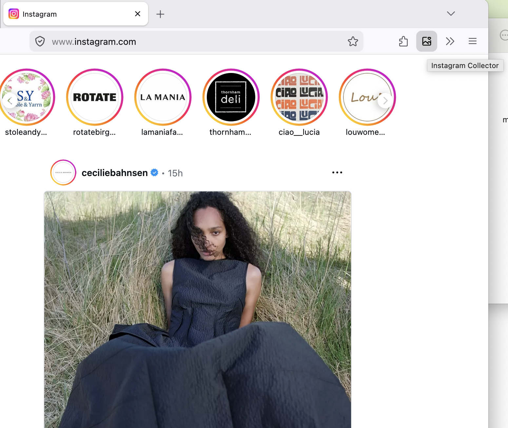
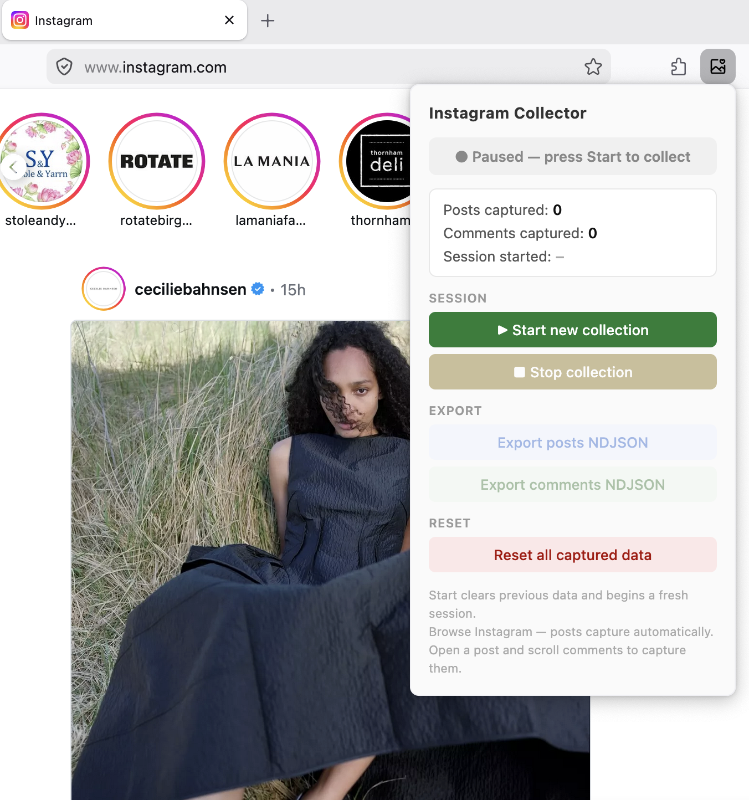
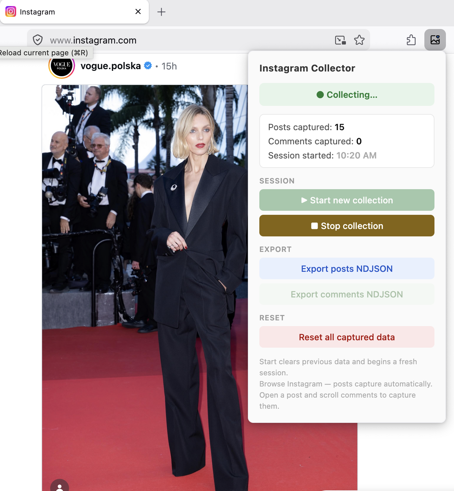
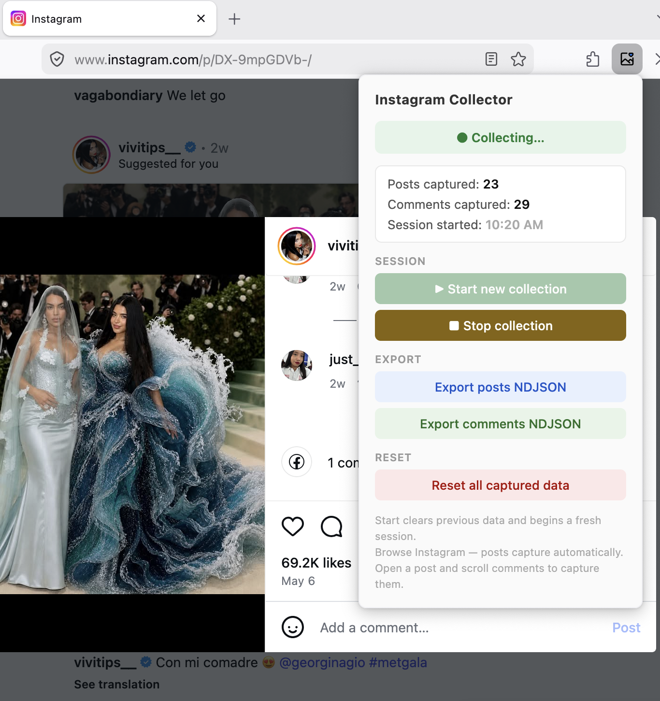
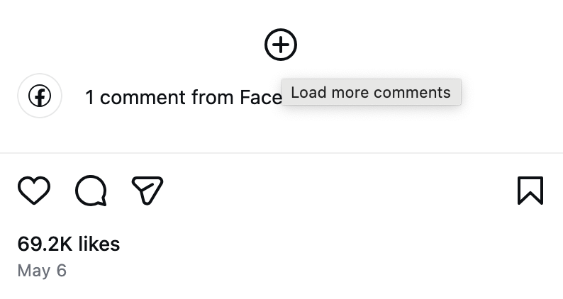
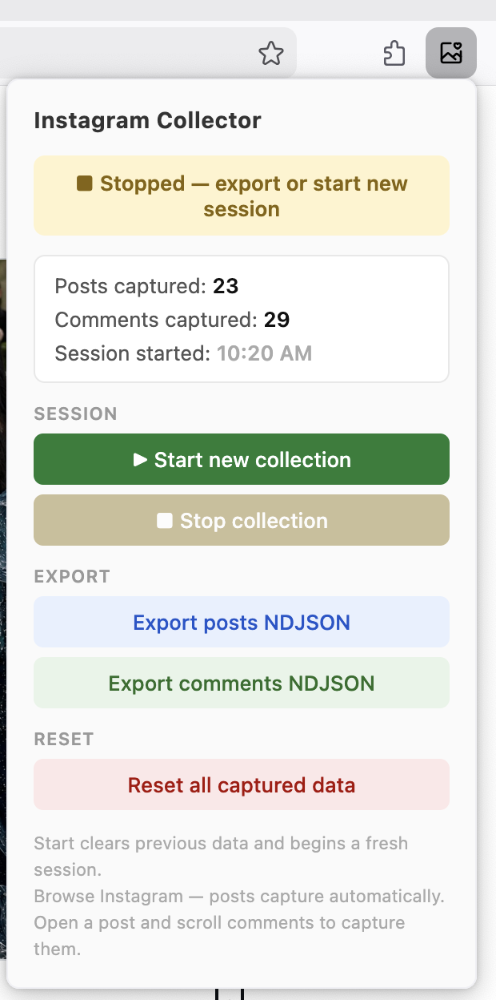

# Instagram Collector

A Firefox extension for researchers that captures Instagram posts and comments as you browse — no scraping scripts, no API keys, no rate limits.

Data is collected passively while you scroll and exported as [NDJSON](https://ndjson.org/) files ready for any research pipeline.

### Background

This tool was inspired by [Zeeschuimer](https://github.com/digitalmethodsinitiative/zeeschuimer) (Digital Methods Initiative), which takes a similar passive-capture approach across several social media platforms. Instagram Collector focuses exclusively on Instagram and fills the gaps Zeeschuimer leaves there: it captures **comments**, **media URLs**, and works across surfaces that Zeeschuimer does not support — including the For You feed, Explore, Reels, Saved posts, and hashtag pages.

### Research use and terms of service

Instagram Collector is a **passive capture** tool. It reads data that your browser has already downloaded as part of normal browsing — it sends no automated requests, performs no crawling, and does not interact with Instagram's servers beyond what you do yourself. This is the same principle as exporting a HAR file from browser DevTools, and the same approach used by tools like Zeeschuimer that are widely accepted in academic research.

That said, Instagram's Terms of Service broadly restrict data collection. Whether and how this tool is appropriate for your study is a question for your institution's ethics review board (IRB/REC). It is your responsibility to ensure your data collection complies with applicable laws and your institution's guidelines.

---

## What it captures

| Field | Posts | Comments |
|---|---|---|
| ID, URL, caption | ✓ | |
| Media type (photo, reel, carousel) | ✓ | |
| Publication date | ✓ | |
| Likes, comments, views | ✓ | |
| Author username, display name, verification status | ✓ | ✓ |
| AI-generated content label (Instagram's own flag) | ✓ | |
| Image URL, video URL, carousel URLs ¹ | ✓ | |
| Comment text & timestamp | | ✓ |
| Like count per comment | | ✓ |

¹ Media URLs are signed CDN links that expire within hours. Download the actual files soon after collecting — see [Media URL expiry](#media-url-expiry) below.

Collection works across **any Instagram surface** — your home feed, hashtag pages, search results, Explore, and saved posts. Whatever loads in the browser gets captured.

---

## How it works

### 1. Install and find the extension

After installing, the Instagram Collector icon appears in your Firefox toolbar.



---

### 2. Start a session

Click the icon to open the popup. Press **Start new collection** — the banner turns green and collection begins.



---

### 3. Scroll to collect posts

Browse Instagram normally. Posts are captured automatically as they load — through your feed, a hashtag page, a profile grid, or saved posts. The counter updates in real time.



---

### 4. Open posts to capture comments

Navigate into a post and scroll down through the comments. Each batch that loads is captured. Use **Load more comments** to go deeper.





---

### 5. Stop and export

When you're done, press **Stop collection**. Both NDJSON export buttons become active — download posts and comments separately.



Each export is a `.ndjson` file (one JSON object per line) timestamped at download time, ready to load into Python, R, or any data tool.

```python
import json

with open("instagram-posts-2026-05-21.ndjson") as f:
    posts = [json.loads(line) for line in f]
```

---

## Installation

**From Firefox Add-ons (AMO):** search for *Instagram Collector* or use the direct link *(coming soon)*.

**Manual install:**
1. Download the latest `instagram-collector.zip` from [Releases](https://github.com/nadiaurban/instagram-collection/releases)
2. In Firefox, go to `about:addons` → gear icon → **Install Add-on From File…**
3. Select the zip file

---

## Privacy

All data stays on your device. The extension stores captures in `browser.storage.local` and writes exports to files you download. It makes no outbound network requests of its own and has no analytics or telemetry. See [PRIVACY.md](PRIVACY.md) for full details.

---

## Limitations

- **Firefox only** — the extension uses Firefox-specific APIs (`browser.webRequest.filterResponseData`) not available in Chrome.
- **Public content only** — private accounts whose posts you cannot see in the browser are not captured.
- **Session-based** — pressing Start clears previous data and begins fresh. Export before starting a new session.
- **Comment pagination** — Instagram loads comments in batches. Scroll through and use "Load more" to capture them all; comments that never load in the browser are not captured.

#### Media URL expiry

The `image_url`, `video_url`, and `carousel_urls` fields in your NDJSON contain signed Instagram CDN links. These URLs expire — typically within a few hours of collection. If you need the actual media files, download them promptly after exporting using a tool like `wget` or a Python script:

```python
import json, requests, pathlib

with open("instagram-posts-2026-05-21.ndjson") as f:
    posts = [json.loads(line) for line in f]

out = pathlib.Path("media")
out.mkdir(exist_ok=True)

for post in posts:
    url = post.get("video_url") or post.get("image_url")
    if not url:
        continue
    ext = ".mp4" if post.get("video_url") else ".jpg"
    dest = out / f"{post['media_id']}{ext}"
    dest.write_bytes(requests.get(url).content)
```

The post permalink (`url` field) is permanent and can be used to revisit the post later, but the CDN media links cannot be refreshed without re-loading the page.

---

## Citing this tool

If you use Instagram Collector in published research, please cite it as:

> Urban, N. (2026). *Instagram Collector* [Firefox extension]. GitHub. https://github.com/nadiaurban/instagram-collection

---

## Questions & contributions

Open an issue on [GitHub](https://github.com/nadiaurban/instagram-collection/issues). This extension was built for academic research and is shared freely with the research community.
